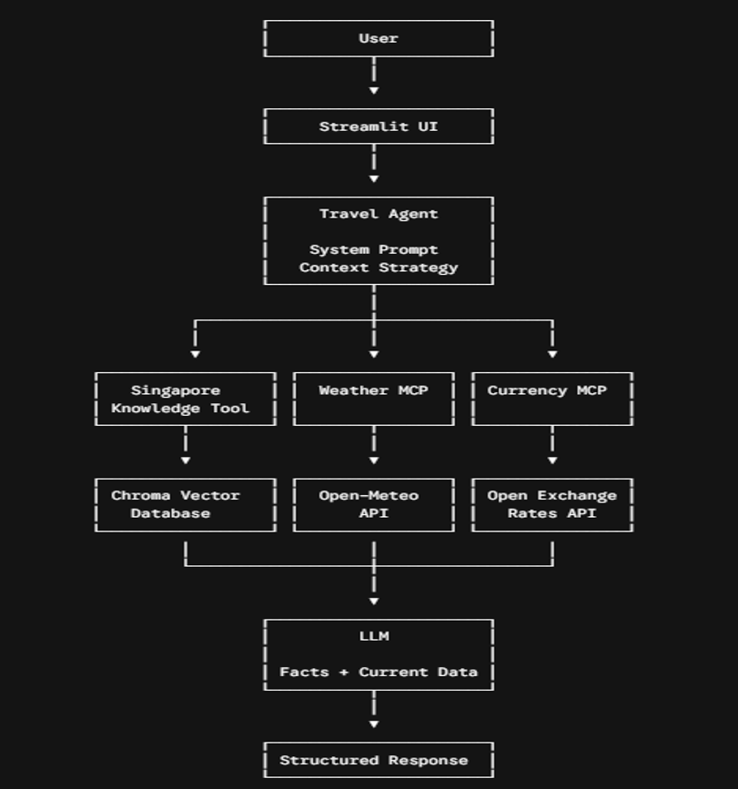

# Singapore Travel Planning Assistant

An AI-powered Singapore travel assistant leveraging **Retrieval-Augmented Generation (RAG)** for local travel knowledge and **Model Context Protocol (MCP)** for live currency conversion and current weather information.

## Project Links

* **GitHub Repository:** https://github.com/dhpadeveloper/travel-assistant
* **Demo Video:** https://nagarro-my.sharepoint.com/:v:/p/harsh_bhagwani/IQA7sEbzLGy0RphfjsTl661tAVBJvPpsutYeEOUIpyO3hIg?e=tTdnaR

---

## Architecture & Workflow



---

## Knowledge Base

The Knowledge Base contains information about Singapore used for destination-related factual questions.

The documents cover:

* Singapore overview
* Attractions
* Neighborhoods
* Transportation
* Culture
* Practical travel information
* Food and local experiences
* Itinerary information
* Indoor and outdoor activities

### Knowledge Base Sources

#### Singapore Basic Information

**Source:** Singapore - Wikivoyage Travel Guide

**URL:** https://en.wikivoyage.org/wiki/Singapore

**File:** `singapore_basic_info.txt`

#### Singapore Travel / Itinerary Information

**Source:** Visit Singapore - Essential Travel Information

**URL:** https://www.visitsingapore.com/travel-tips/travelling-to-singapore

**File:** `singapore_itinerary.txt`

#### Singapore Things To Do

**Source:** Visit Singapore - Things to Do

**URL:** https://www.visitsingapore.com/things-to-do/top-things-to-do

**File:** `singapore_things_to_do.txt`

Source title and URL are stored as document metadata so that relevant source references can be provided in the response.

---

## RAG Workflow

1. Load Singapore travel documents into the Knowledge Base.
2. Split documents into smaller chunks.
3. Generate embeddings using the Gemini embedding model.
4. Store embeddings and metadata in ChromaDB.
5. User asks a destination-related question.
6. `search_singapore_knowledge` retrieves relevant chunks.
7. Retrieved information is passed to the LLM as grounded context.
8. The LLM generates the response using the retrieved information.
9. Source metadata is retained for source references.
10. If sufficient information is unavailable, the assistant does not guess.

---

## MCP Tools Workflow

### Weather MCP

1. User asks about Singapore weather.
2. Agent calls the Weather MCP.
3. MCP server runs `weather_mcp.py` via STDIO.
4. Weather data is retrieved from the Open-Meteo API.
5. Weather data is returned to the agent.
6. Agent uses the data to provide the final response.

### Currency MCP

1. User asks for currency conversion.
2. Agent calls the Currency MCP.
3. MCP server runs `currency_mcp.py` via STDIO.
4. The latest exchange rate is retrieved from the Open Exchange Rates API.
5. The requested amount is converted.
6. Conversion data is returned to the agent.
7. Agent provides the final response.

---

## Agent Design

The Travel Agent is built using **LangChain** and the **Gemini LLM**.

The agent connects the following tools:

* `search_singapore_knowledge` → retrieves Singapore destination facts from the ChromaDB Knowledge Base.
* `get_singapore_weather` → retrieves current/forecast weather through the Weather MCP server.
* `convert_currency` → performs currency conversion through the Currency MCP server.

### Tool Integration

* MCP tools are discovered using `MultiServerMCPClient` and added to the agent's tool list.
* The agent uses the system prompt to decide which tool to call based on the user's question.
* It combines RAG information, current MCP data, and user preferences to generate travel recommendations.
* If required information is unavailable, the agent states that it cannot verify the information instead of guessing.

---

## Prompt Strategy

A system prompt controls how the agent uses the different information sources.

The prompt establishes a clear separation between:

* **Knowledge Base** → destination facts
* **MCP Tools** → current information
* **LLM** → recommendations and itinerary planning

### 1. Role / System Prompt

**What it does:** Sets the assistant's role as a Singapore travel planning assistant.

**Why:** Keeps responses professional, concise, structured, and travel-focused.

### 2. RAG Guardrails

**What it does:** Instructs the LLM to use retrieved Knowledge Base content for Singapore destination facts.

**Why:** If the Knowledge Base does not contain enough information, the assistant states that the information is unavailable instead of making up facts.

### 3. Smart Tool Routing

**What it does:** Instructs the assistant when to use the Knowledge Base versus MCP tools.

**Why:** Currency conversion and current weather information are obtained through MCP tools instead of relying on potentially outdated model knowledge.

### 4. User Context

**What it does:** Preserves relevant preferences from the conversation, such as trip duration, interests, budget, and preferred travel pace.

**Why:** Allows the assistant to provide context-aware recommendations without requiring the user to repeat their preferences.

---

## Setup Instructions

### Prerequisites

Install:

* Python
* `uv`
* Google Gemini API key

The project uses:

* Python
* LangChain
* Google Gemini
* ChromaDB
* MCP
* Streamlit
* `uv`

### Step 1: Clone the Project

```bash
git clone https://github.com/dhpadeveloper/travel-assistant.git
cd travel-assistant
```

### Step 2: Install Dependencies

This project uses `uv` for environment and dependency management.

```bash
uv sync
```

If you are using an existing `requirements.txt` instead of `pyproject.toml`:

```bash
uv pip install -r requirements.txt
```

For the recommended project setup, use `uv sync` with dependencies declared in `pyproject.toml`.

### Step 3: Configure Environment Variables

Create a `.env` file in the project root:

```env
GOOGLE_API_KEY=your_google_api_key
```

The application loads environment variables using:

```python
from dotenv import load_dotenv

load_dotenv()
```

### Step 4: Build the Vector Database

Before running the assistant, create the Chroma vector database:

```bash
uv run python build_vector_db.py
```

This loads the Knowledge Base documents, creates embeddings, and stores them in ChromaDB.

### Step 5: Run the Application

Start the Streamlit application:

```bash
uv run streamlit run app.py
```

Streamlit will display the application URL in the terminal.

Open the displayed URL in a browser.

---

## Example Scenarios

### 1. Destination Information

**Question:**

> What are some top outdoor attractions to visit in Singapore?

**Answer:**

Here are some of the top outdoor attractions to visit in Singapore:

* **Mandai Wildlife Reserve:** A major wildlife destination that includes attractions such as Singapore Zoo, Night Safari, River Wonders, and Bird Paradise.
* **Gardens by the Bay:** A waterfront garden in the Marina Bay area featuring the iconic Supertrees and botanical displays.
* **Singapore Botanic Gardens:** A UNESCO World Heritage Site with walking paths, lakes, and the National Orchid Garden.
* **Henderson Waves:** A pedestrian bridge known for its distinctive wave-like structure and views of the surrounding area.
* **Bukit Timah Nature Reserve:** A nature reserve containing primary rainforest and a variety of local wildlife.
* **Pulau Ubin:** An island near Changi Village offering opportunities for cycling and exploring Singapore's rural landscapes.

**Sources:**

* Visit Singapore - Things to Do
* Singapore - Wikivoyage Travel Guide

---

### 2. Weather and Currency

**Question:**

> What is the weather like in Singapore today, and what is ₹20,000 INR in SGD?

**Answer:**

#### Weather in Singapore

* **Forecast:** Thunderstorms/rain with a high probability of precipitation.
* **Temperature:** Approximately 29.5°C high and 25.3°C low.
* **Source:** Weather MCP

#### Currency Conversion

* ₹20,000 INR is approximately **SGD 266.36** based on the exchange rate retrieved at the time of the request.
* **Source:** Currency MCP

---

### 3. Weather-Adjusted Three-Day Itinerary

**Question:**

> Plan a three-day trip to Singapore and adjust the activities based on the weather forecast.

**Answer:**

Here is a weather-adjusted three-day itinerary for Singapore.

The itinerary uses the weather forecast retrieved through the **Weather MCP** and adjusts outdoor activities when rain or thunderstorms are expected.

#### Day 1: Gardens and Marina Bay

**Weather:** High of approximately 29.5°C, low of 25.3°C, with a high probability of thunderstorms.

* **Morning:** Visit Gardens by the Bay and explore the Cloud Forest and Flower Dome.
* **Afternoon:** Explore the Marina Bay Sands Shoppes and other nearby indoor attractions.
* **Evening:** Visit the Marina Bay area if weather conditions permit and have dinner at a nearby indoor dining location.

#### Day 2: Wildlife and Indoor Attractions

**Weather:** High of approximately 32.2°C, low of 24.6°C, with a high probability of rain.

* **Morning:** Visit River Wonders, which provides sheltered areas while exploring its exhibits.
* **Afternoon:** If heavy rain continues, visit an indoor attraction such as the ArtScience Museum or explore Orchard Road's indoor shopping complexes.
* **Evening:** Enjoy local food at a covered or air-conditioned dining location such as Lau Pa Sat.

#### Day 3: Sentosa Indoor Activities

**Weather:** High of approximately 30.5°C, low of 24.8°C, with a high probability of thunderstorms.

* **Morning:** Visit Universal Studios Singapore.
* **Afternoon:** Alternatively, visit the S.E.A. Aquarium for a predominantly indoor experience.
* **Evening:** Have dinner at VivoCity or another nearby indoor dining location.

**Information Sources:**

* Visit Singapore - Travel and Itinerary Information
* Singapore Knowledge Base
* Weather MCP

**Key Point:** This scenario demonstrates how the agent combines **Knowledge Base information** with **current weather data from MCP** to produce a weather-aware travel recommendation.
